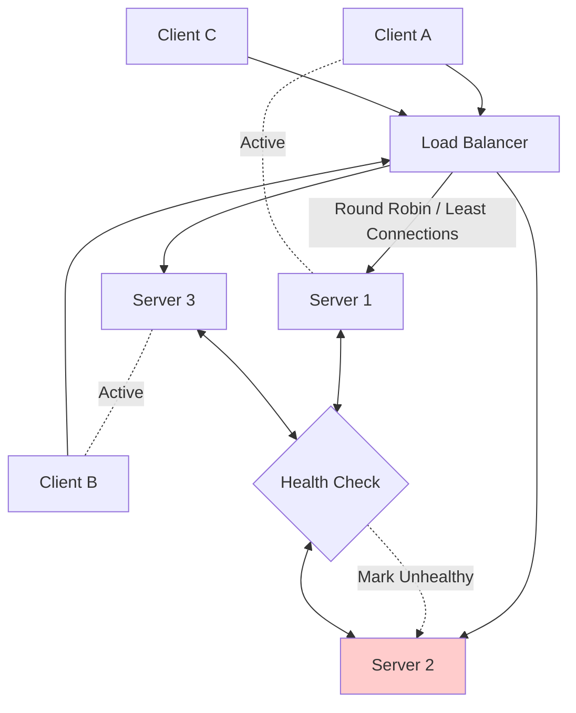

# Load Balancing

## Overview

**Load balancing** is the process of distributing incoming network traffic across multiple servers to ensure no single server becomes overwhelmed, maximizing throughput and minimizing response time. In modern distributed systems, load balancers act as the single entry point for all client requests, providing both scalability and fault tolerance. This topic frequently appears in system design interviews because it sits at the intersection of networking, algorithms, and architecture trade-offs.

## Key Concepts

- **Traffic Distribution**: Evenly spreading client requests across available backend instances based on defined algorithms.
- **Health Checking**: Continuously monitoring server health to route traffic only to operational nodes.
- **Layer 4 vs Layer 7 Balancing**: Balancing at the transport layer (TCP/UDP) versus the application layer (HTTP/HTTPS) based on OSI model depth.
- **Session Persistence**: Maintaining client-server affinity by routing requests from the same client to the same backend server.
- **Geographic Routing**: Directing traffic based on client location using DNS or anycast techniques.
- **Graceful Degradation**: Removing failing servers from rotation without disrupting active connections.

## Theory & Fundamentals

**Layer 4 (Transport) load balancing** operates by inspecting network-level information like source/destination IP addresses and ports, making routing decisions without understanding application content. This approach offers higher throughput and lower latency since the balancer doesn't parse HTTP headers or payloads. Common use cases include TCP-based protocols and scenarios where deep packet inspection isn't required.

**Layer 7 (Application) load balancing** examines HTTP/HTTPS headers and content, enabling sophisticated routing decisions based on URL paths, cookies, or request attributes. This allows features like path-based routing (sending `/api/*` to one cluster, `/static/*` to another) and cookie-based session affinity. The tradeoff is higher latency and resource consumption compared to Layer 4, but with greater flexibility.

**Health checks** are critical for maintaining system reliability—load balancers periodically send probes (TCP connections, HTTP GETs, or custom scripts) to backends and mark unhealthy nodes as unavailable. The frequency, timeout, and threshold settings (how many failures before marking down) directly impact the balance between detecting failures quickly and avoiding false positives from transient issues.

**Load balancing algorithms** determine how requests are distributed. **Round Robin** cycles sequentially through servers, working well when servers have identical capacity. **Least Connections** routes to the server with the fewest active requests, ideal for varying request durations. **IP Hash** maps clients to servers deterministically based on their IP, ensuring session consistency without explicit cookies.

## Visual Diagrams



## Code Examples (Java)

### Simple Round Robin Load Balancer

```java
public class RoundRobinLoadBalancer<T> {
    private final List<T> servers = new ArrayList<>();
    private final AtomicInteger index = new AtomicInteger(0);
    
    public void addServer(T server) {
        servers.add(server);
    }
    
    public T getNextServer() {
        if (servers.isEmpty()) {
            throw new IllegalStateException("No servers available");
        }
        // CAS-based modulo to prevent lock contention under high concurrency
        int pos = Math.abs(index.getAndIncrement() % servers.size());
        return servers.get(pos);
    }
}
```

### Health-Aware Server Pool Manager

```java
public class ServerPool {
    private final Map<String, ServerState> servers = new ConcurrentHashMap<>();
    private final ScheduledExecutorService healthCheck = 
        Executors.newScheduledThreadPool(2);

    public void registerServer(String id, String url) {
        servers.put(id, new ServerState(id, url, true));
        scheduleHealthCheck(id);
    }

    private void scheduleHealthCheck(String id) {
        healthCheck.scheduleAtFixedRate(() -> {
            ServerState state = servers.get(id);
            boolean healthy = performHealthCheck(state.getUrl());
            state.setHealthy(healthy);
        }, 0, 10, TimeUnit.SECONDS);
    }

    public String getHealthyServer() {
        return servers.entrySet().stream()
            .filter(e -> e.getValue().isHealthy())
            .findFirst()
            .map(Entry::getKey)
            .orElseThrow(() -> new ServiceUnavailableException());
    }
}
```

## Common Interview Questions

**How would you design a load balancer that handles millions of requests per second?**

Focus on the architecture: use Layer 4 for raw performance with DSR (Direct Server Return) to bypass the load balancer on return paths, implement consistent hashing for horizontal scaling without invalidating cache, and use multiple availability zones with geographic distribution. The key insight is separating control plane (configuration, health checks) from data plane (packet forwarding) using tools like IPVS or DPDK.

**What's the difference between active and passive health checks, and when would you prefer each?**

Active checks are periodic probes initiated by the load balancer; passive checks observe real traffic responses. Active checks are more proactive but consume resources and network bandwidth. Passive checks are lightweight but only detect failures after they've affected real users—use passive for high-frequency monitoring and active for periodic deep health validation.

**How does consistent hashing help with load balancer scalability?**

Consistent hashing maps both servers and requests to a hash ring, ensuring that when servers are added or removed, only a fraction of keys remap (typically K/n). This prevents the "thundering herd" problem where every client invalidates its cache simultaneously during scaling events. Interviewers want to hear about virtual nodes for even distribution and the tradeoff with additional memory overhead.

**Why might you choose sticky sessions, and what are the trade-offs?**

Sticky sessions eliminate the need to share session state across servers by binding a client to one server. This simplifies application logic and reduces inter-server communication. However, it creates load imbalance (some users generate more load than others), reduces fault tolerance (that server going down loses session state), and makes horizontal scaling harder. Modern architectures prefer external session stores like Redis unless latency constraints are severe.

**How do you handle the load balancer itself becoming a single point of failure?**

Deploy load balancers in active-active or active-passive configurations with floating IPs for failover. Use DNS-based health checking where clients discover available balancers, or implement anycast where multiple balancers share the same IP and routing automatically routes around failures. The interviewer wants to see you understand that redundancy must extend all the way down the chain.

## Tips & Gotchas

**Don't oversimplify algorithm comparison.** Interviewers will push back if you only say "Round Robin is simple, Least Connections is better." Be ready to explain the worst-case behavior: Round Robin can overload slow servers, while Least Connections can cause momentary spikes during rapid scaling. Mention that actual production systems often combine algorithms—like weighted least connections with geographic awareness.

**Avoid claiming "the load balancer is always Layer 7 for better performance."** This is a common trap. Layer 4 can achieve 10x higher throughput with 10x lower latency in some implementations because it doesn't decrypt or parse HTTPS. The right answer depends on requirements: if you need URL-based routing or authentication, Layer 7 is necessary; otherwise, Layer 4 often wins.

**Interviewers look for understanding of failure modes.** Many candidates describe happy-path load balancing but stumble when asked "what happens during a partial cluster failure." Strong candidates discuss connection draining (completing in-flight requests before server removal), circuit breakers (preventing cascading failures), and how to distinguish between network partitions and actual server failures.

**Know the difference between load balancing and reverse proxies.** These concepts overlap but aren't identical. Nginx and HAProxy can do both, but true load balancers (like AWS NLB) often operate at Layer 4 with kernel-bypass networking, while reverse proxies (like Envoy, Traefik) provide richer application-layer features. Understanding when each applies demonstrates architectural maturity.