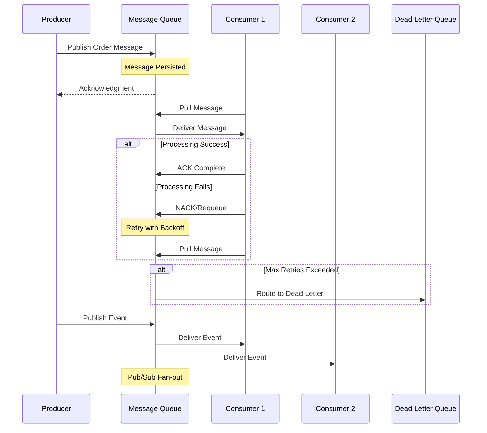

# Message Queues

## Overview

**Message Queues** decouple producers from consumers by providing asynchronous communication between services. They enable **horizontal scaling**, **fault tolerance**, and **temporal decoupling** in distributed systems. This pattern is foundational for building resilient microservices architectures where components must communicate without tight dependencies or blocking operations.

Real-world applications include order processing systems that queue incoming orders for async fulfillment, notification services that batch and deliver emails/SMS, and financial systems that need guaranteed processing of transactions. Major cloud offerings like AWS SQS, Google Cloud Pub/Sub, and Azure Service Bus handle billions of messages daily.

## Key Concepts

- **Asynchronous Messaging** allows producers to send messages without waiting for immediate consumer response
- **At-Least-Once Delivery** guarantees messages will be delivered, but may be duplicated
- **Exactly-Once Semantics** ensures no message loss or duplication through idempotent consumers
- **Message Durability** persists messages to disk before acknowledging receipt
- **Pub/Sub Pattern** enables one-to-many message distribution to multiple subscribers
- **Backpressure Handling** manages producer speed when consumers are overwhelmed

## Theory & Fundamentals

### Producer-Consumer Decoupling

The producer sends messages to a queue without knowing who will consume them or when. The consumer retrieves messages at its own pace, processing them independently. This separation allows each side to scale independently and evolve without tight coupling. For example, a web server can accept user uploads quickly by queuing them, while a slower backend worker processes them asynchronously.

### Queue Topologies

**Point-to-Point** queues deliver each message to exactly one consumer—ideal for task processing. **Publish-Subscribe** topics broadcast messages to all subscribers, enabling event-driven architectures where multiple services react to the same event. **Message filtering** allows subscribers to receive only relevant subsets of messages based on routing rules or content matching.

### Delivery Guarantees

**At-least-once** delivery requires consumers to acknowledge messages only after successful processing, with failed messages returned to the queue for retry. **Exactly-once** delivery combines deduplication at the application level with producer-side message IDs to prevent duplicate processing. **At-most-once** delivery discards messages if they cannot be delivered immediately, suitable for metrics or telemetry where occasional loss is acceptable.

### Ordering Guarantees

Most message queues provide **FIFO ordering** only within a single partition or shard. Achieving global ordering across distributed systems requires additional coordination or accepting that messages from different producers may interleave. Understanding your ordering requirements determines whether you need partitioning strategies or sequence numbers in your application logic.

### Dead Letter Queues

Messages that fail processing after maximum retry attempts are routed to a **Dead Letter Queue (DLQ)** for manual inspection and intervention. DLQs prevent poison messages from blocking the main queue and enable operational recovery. Monitoring DLQ depth provides early warning of systemic processing failures.

## Visual Diagrams



## Code Examples (Java)

### Basic Message Producer and Consumer

```java
// Producer: Sends messages with delivery confirmation
public class OrderProducer {
    private final AmazonSQS sqs;
    private final String queueUrl;
    
    public void sendOrder(Order order) {
        String messageBody = serialize(order);
        SendMessageRequest request = SendMessageRequest.builder()
            .queueUrl(queueUrl)
            .messageBody(messageBody)
            .messageGroupId("orders")  // Ensures FIFO within group
            .messageDeduplicationId(order.getOrderId())  // Prevents duplicates
            .build();
        
        SendMessageResponse response = sqs.sendMessage(request);
        System.out.println("Message sent: " + response.messageId());
    }
}

// Consumer: Processes messages with visibility timeout handling
public class OrderProcessor {
    public void processMessages() {
        ReceiveMessageRequest request = ReceiveMessageRequest.builder()
            .queueUrl(queueUrl)
            .maxNumberOfMessages(10)
            .visibilityTimeout(30)  // Lock duration before re-queue
            .waitTimeSeconds(20)   // Long polling
            .build();
        
        List<Message> messages = sqs.receiveMessage(request).messages();
        
        for (Message msg : messages) {
            try {
                Order order = deserialize(msg.body());
                fulfillOrder(order);
                sqs.deleteMessage(queueUrl, msg.receiptHandle()); // ACK
            } catch (ProcessingException e) {
                // NACK implicit on exception; message becomes visible again
                scheduleRetry(msg); // Custom retry logic
            }
        }
    }
}
```

### Distributed Pub/Sub with Topic Filtering

```java
// Topic publisher with attributes for filtering
public class EventPublisher {
    private final AmazonSNS sns;
    
    public void publishUserEvent(String userId, String eventType, Map<String, Object> payload) {
        Map<String, MessageAttributeValue> attributes = Map.of(
            "eventType", MessageAttributeValue.builder()
                .dataType("String")
                .stringValue(eventType)
                .build(),
            "userRegion", MessageAttributeValue.builder()
                .dataType("String")
                .stringValue(extractRegion(userId))
                .build()
        );
        
        PublishRequest request = PublishRequest.builder()
            .topicArn("arn:aws:sns:us-east-1:123456789012:user-events")
            .messageStructure("json")
            .message(serializeWithDefault(payload))
            .messageAttributes(attributes)
            .build();
        
        sns.publish(request);
    }
}
```

## Common Interview Questions

**How would you design a message queue system that handles 1 million messages per second?**

Focus on **partitioning strategy** to distribute load across multiple queue instances. Discuss **batch processing** to amortize network overhead, **compression** to reduce bandwidth, and **consumer scaling** with auto-scaling groups based on queue depth. Address the trade-off between throughput and ordering guarantees—FIFO queues often have lower throughput due to partitioning constraints.

**What's the difference between at-least-once and exactly-once delivery? When would you choose each?**

At-least-once is simpler and higher throughput; exactly-once requires idempotent consumers with deduplication logic at the application level. Choose exactly-onon when duplicate processing has business consequences (billing, inventory). At-least-once suits notification systems or analytics where occasional duplicates are tolerable.

**How do you handle poison messages that always fail processing?**

Implement a **dead letter queue** with maximum retry attempts. Monitor DLQ depth with alerting. For recoverable failures, use **exponential backoff** between retries. For genuinely corrupt messages, investigate the root cause and fix the producer schema or consumer logic before manually replaying from DLQ.

**Design a workflow where messages must be processed in strict sequence across distributed consumers.**

This requires **sharding by correlation ID**—all messages belonging to the same workflow routed to the same partition and consumer. Discuss **sequence numbers** embedded in messages, **checkpointing** processed offsets, and acknowledging only after downstream dependencies complete. Address the latency tradeoff: strict ordering often means waiting for previous messages before processing current ones.

**What happens when your message queue becomes unavailable?**

Discuss **circuit breakers** and **graceful degradation**—services should buffer locally or switch to fallback mechanisms. Distinguish between producer-facing unavailability (messages lost if not persisted) and consumer-facing issues (backpressure builds). Address the importance of **multi-AZ deployment** and understanding your queue's durability SLAs.

## Tips & Gotchas

- **Don't assume ordering by default.** Many queues only guarantee ordering within a single partition. If your business logic requires strict sequence, explicitly partition by entity ID and accept the throughput trade-off.

- **Avoid treating queues like databases.** Messages should be transient events, not state. If you find yourself querying queue history or storing references to old messages, reconsider whether a database with CDC (Change Data Capture) better fits your use case.

- **Watch visibility timeout carefully.** Setting it too short causes premature re-queue while the original consumer still processes it (duplicate delivery). Too long delays detection of crashed consumers. Calculate based on your worst-case processing time plus buffer.

- **Long polling is essential for cost efficiency.** Without it, consumers poll frequently and pay for empty responses. Configure appropriate wait time to reduce API calls while maintaining reasonable latency.

- **Interviewers look for depth on trade-offs.** A senior candidate should articulate that higher durability (syncing to disk) increases latency, that fan-out patterns can overwhelm slow consumers, and that DLQ monitoring is operations hygiene, not an afterthought.