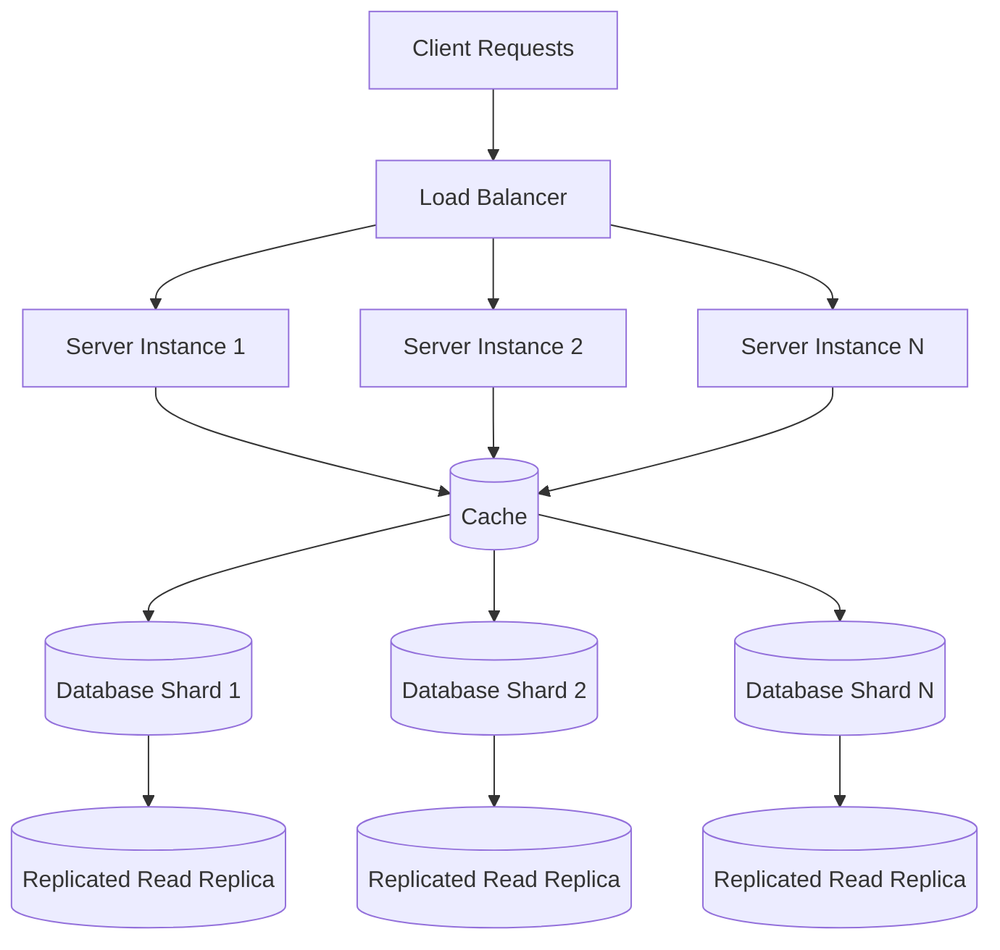

# Scalability Fundamentals

## Overview

**Scalability** is the capacity of a system to handle growing workloads by adding resources without compromising performance or availability. In distributed systems, scalability determines whether your architecture can support millions of users or crumble under demand. Interviewers probe scalability because it reveals your ability to design systems that grow gracefully—handling 10x, 100x, or even 1000x traffic without architectural rewrites.

## Key Concepts

- **Vertical scaling** increases individual machine capacity (CPU, RAM, storage) to handle more load
- **Horizontal scaling** adds more machines to distribute workload across a fleet of servers
- **Load balancing** routes traffic across multiple backend instances using various algorithms
- **Sharding** partitions data across database instances using a distribution key
- **Caching** stores frequently accessed data in memory to reduce database load
- **Stateless services** store no user session data locally, enabling horizontal scaling
- **Consistent hashing** minimizes data redistribution when adding or removing nodes

## Theory & Fundamentals

### Vertical vs Horizontal Scaling

**Vertical scaling** (scaling up) involves upgrading a single server with more CPU cores, RAM, or faster storage. This approach is simpler to implement—your application code doesn't change—but hits a physical ceiling. A machine can only be so powerful, and you'll have a single point of failure. **Horizontal scaling** (scaling out) adds more commodity servers to your pool. It's harder to implement because you must handle distributed state and network communication, but it offers near-linear growth potential and fault tolerance through redundancy.

### Load Balancing

A **load balancer** sits between clients and your server fleet, distributing incoming requests according to an algorithm. Round-robin is simple but ignores server load. Least connections routes to the server with fewest active requests. IP hash binds a user to a specific server (useful when caching user data locally). Health checks ensure traffic only goes to healthy instances. Modern load balancers also handle SSL termination and can route based on content (layer 7 routing).

### Database Sharding

**Sharding** partitions your database by splitting rows across multiple database instances using a shard key. A user sharding strategy might use `user_id % 4` to route to one of four shards. The critical challenge is choosing a shard key that distributes load evenly—if 20% of users are power users, a naive user_id sharding could create hotspots. Sharding adds operational complexity—cross-shard queries become expensive, and resharding without downtime is notoriously difficult.

### Caching Strategies

**Caching** exploits the temporal and spatial locality of access patterns. A cache sits in front of your database, storing hot data in memory. Write-through caches update the cache and database synchronously—consistent but slower. Write-back caches update only the cache, writing to the database asynchronously—faster but risky on crashes. Cache invalidation remains one of the hardest problems in systems design; stale data can cause subtle bugs while aggressive invalidation defeats the cache's purpose.

### Consistent Hashing

Traditional hashing with `key % N` breaks badly when N changes—every key potentially remaps to a different node. **Consistent hashing** maps both keys and nodes onto a hash ring. A key is stored on the first node found clockwise from its hash position. When a node is added or removed, only its neighboring keys remap. Virtual nodes improve distribution by assigning each physical node multiple positions on the ring, smoothing out uneven data distribution.

## Visual Diagrams



## Code Examples (Java)

### Consistent Hash Ring Implementation

```java
public class ConsistentHashRing<T> {
    private final SortedMap<Integer, T> ring = new TreeMap<>();
    private final int virtualNodes;
    
    public ConsistentHashRing(int virtualNodes) {
        this.virtualNodes = virtualNodes;
    }
    
    public void addNode(T node) {
        for (int i = 0; i < virtualNodes; i++) {
            int hash = Math.abs((node.hashCode() + i).hashCode());
            ring.put(hash, node); // Virtual nodes distribute load evenly
        }
    }
    
    public T getNode(String key) {
        if (ring.isEmpty()) throw new IllegalStateException("No nodes available");
        int hash = Math.abs(key.hashCode());
        // Find first node clockwise on ring
        Map.Entry<Integer, T> entry = ring.ceilingEntry(hash);
        return entry != null ? entry.getValue() : ring.firstEntry().getValue();
    }
    
    public void removeNode(T node) {
        for (int i = 0; i < virtualNodes; i++) {
            int hash = Math.abs((node.hashCode() + i).hashCode());
            ring.remove(hash); // Only neighbors' keys remap
        }
    }
}
```

### Database Sharding Router

```java
public class ShardRouter {
    private final int shardCount;
    private final List<DataSource> shards;
    
    public ShardRouter(int shardCount, List<DataSource> shards) {
        this.shardCount = shardCount;
        this.shards = shards;
    }
    
    public DataSource getShardForUserId(long userId) {
        int shardIndex = (int) (userId % shardCount);
        return shards.get(shardIndex);
    }
    
    public User getUser(long userId) {
        DataSource shard = getShardForUserId(userId);
        return shard.query("SELECT * FROM users WHERE id = ?", userId);
    }
    
    // Cross-shard queries require scatter-gather pattern
    public List<User> getUsersByPrefix(String prefix) {
        List<User> results = new ArrayList<>();
        for (DataSource shard : shards) {
            results.addAll(shard.query(
                "SELECT * FROM users WHERE name LIKE ?", prefix + "%"));
        }
        return results; // Returns data from all shards
    }
}
```

## Common Interview Questions

**How would you scale a system from 1,000 to 1,000,000 users?**

Start with profiling to identify actual bottlenecks—premature optimization wastes effort. Typically, you'll scale horizontally: add load balancers, scale web servers, introduce caching, then database read replicas. Only consider sharding when the database is genuinely the bottleneck. Each step should be justified by metrics.

**What's the difference between scaling up vs scaling out? When would you choose each?**

Vertical scaling is simpler and ideal for databases where distribution adds significant complexity (joins across shards). Horizontal scaling provides fault tolerance and near-unlimited growth potential. Modern cloud-native architectures prefer horizontal because it aligns with auto-scaling and reduces blast radius of failures.

**How do you handle database hot spots with sharding?**

Choose a shard key with high cardinality and uniform distribution. Avoid natural keys that correlate with access patterns (timestamps, sequential IDs). Consider application-level denormalization—storing pre-computed aggregates or frequently joined data on the same shard.

**What are the CAP theorem implications for scalable systems?**

CAP states you can only guarantee two of: consistency, availability, and partition tolerance. Network partitions are inevitable in distributed systems, forcing a choice between consistency (CP systems like ZooKeeper) and availability (AP systems like Cassandra). Most web applications choose availability with eventual consistency, accepting stale reads during partitions.

**How does caching interact with database consistency?**

Caching introduces a fundamental trade-off: stronger consistency guarantees require more complex invalidation, which reduces cache hit rates. The two-generational hypothesis suggests most data is either very hot (heavily cached) or cold (rarely accessed). Focus cache energy on the hot 20% of data that drives 80% of load.

## Tips & Gotchas

**Interviewers probe for depth, not just definitions.** Reciting textbook definitions of horizontal vs vertical scaling signals junior-level understanding. Instead, discuss trade-offs: "Vertical scaling simplifies consistency but creates single points of failure and caps growth."

**Avoid premature optimization.** Candidates who immediately jump to complex solutions (sharding, custom caching layers) miss the signal. Strong candidates ask: "What's the current bottleneck?" before recommending architectural changes.

**Understand operational complexity.** Every scalability pattern you add (sharding, multi-level caching, eventual consistency) has an operational cost. Interviewers want to see you balance theoretical scalability against real-world maintainability. Mentioning that sharding complicates schema changes and cross-shard queries demonstrates production experience.

**Be prepared to back-of-envelope calculate.** "How much memory do you need for 100 million user sessions?" requires understanding data structures, not just concepts. Practice estimating storage requirements, network bandwidth, and database load before your interview.

**The best answers show trade-off reasoning.** "I would start with read replicas because they solve 80% of read-heavy workloads with minimal complexity, and only introduce sharding when write throughput actually exceeds a single leader's capacity."